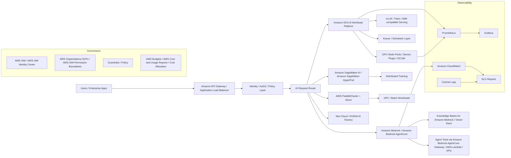

# Reference Architecture

## High-level architecture

## Control plane responsibilities

The AI control plane must answer:

- Who can access which model, tool, data source, and environment?
- Which workloads run on Amazon Bedrock, Amazon EKS, Amazon SageMaker AI, AWS ParallelCluster + Slurm, AWS Trainium, AWS Inferentia, or NVIDIA GPU platforms?
- How are inference SLOs measured?
- How are GPU and token costs attributed?
- How are tenant boundaries enforced?
- How are agent actions governed and audited?
- How are production incidents handled?

## Initial architecture choices

| Area | Default choice | Reason |
|---|---|---|
| Enterprise agent runtime | Amazon Bedrock AgentCore | Managed agent runtime, identity, gateway, memory, and observability |
| General enterprise RAG | Knowledge Bases for Amazon Bedrock | Managed retrieval path and lower platform burden |
| Custom model inference | Amazon EKS + vLLM/Triton | Better control over serving, scaling, and custom runtime needs |
| Distributed training | Amazon SageMaker HyperPod or Amazon EKS | Depends on team maturity and workload scale |
| HPC batch | AWS ParallelCluster + Slurm | Better cultural and scheduler fit for HPC-style workloads |
| GPU-heavy AI factory | NVIDIA stack / Neo Cloud / on-prem | Best for sustained GPU-heavy platforms and specialized networking |
