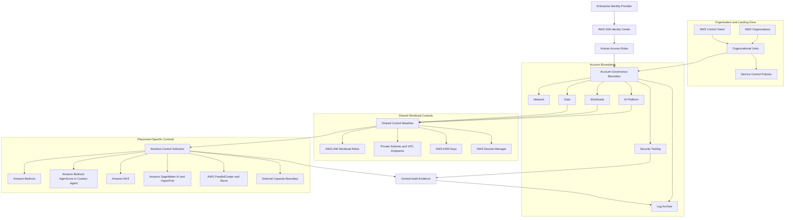
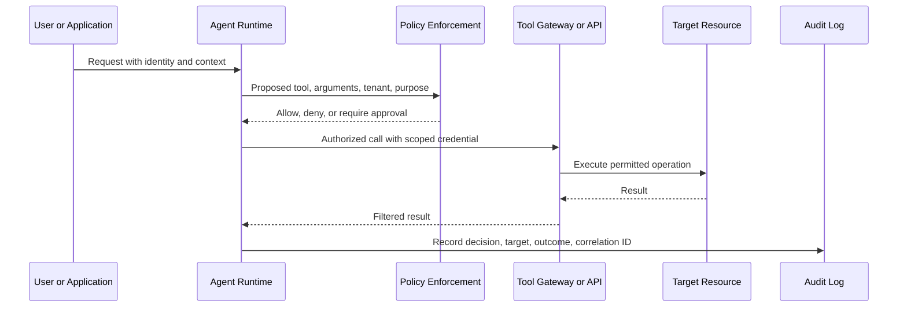

# Security Model

## Purpose

This document defines the security boundaries and control responsibilities for the enterprise AI control plane. It covers the AWS multi-account foundation, human and workload identity, private connectivity, encryption, secrets, tenant isolation, platform-specific runtime controls, and audit evidence.

It is a reference model, not a complete control implementation. Service support, endpoint availability, data handling, and regulatory requirements must be validated for each workload and AWS Region.

This document can be read independently. The [reference architecture](01-reference-architecture.md) provides the broader platform context, while the [workload placement matrix](02-workload-placement-matrix.md) explains why a workload is assigned to a particular runtime.

## Security Objectives

The model is intended to:

- prevent unauthorized access to models, data, tools, infrastructure, and tenant resources;
- limit the impact of compromised identities, workloads, images, agents, nodes, and accounts;
- protect data and credentials in transit, at rest, and during authorized use;
- preserve tenant and environment boundaries;
- make privileged and consequential actions attributable and reviewable; and
- provide sufficient evidence to investigate, contain, and recover from security events.

## Scope and Non-Goals

This document defines control architecture and ownership boundaries. It does not provide:

- workload-specific AWS IAM, AWS KMS, network, Kubernetes, or Slurm configuration;
- a threat model for a particular application, model, dataset, tenant, or regulatory regime;
- a complete secure software development lifecycle or model supply-chain standard;
- detailed prompt-injection, model evaluation, content-safety, privacy, backup, disaster-recovery, or incident-response procedures;
- proof of compliance with any framework or regulation; or
- assurance that a service, feature, endpoint, or control is available in every AWS Region.

Those concerns remain required where applicable and should reference this model rather than being assumed to be satisfied by it.

## Assumptions

- Multiple AWS accounts separate platform, security, data, and workload responsibilities.
- AWS Control Tower may establish and govern the landing zone, but it is not assumed to be the only provisioning mechanism.
- Workforce identities originate in an enterprise identity provider and are federated through AWS IAM Identity Center.
- Applications and automation use temporary credentials through AWS IAM roles rather than long-lived IAM user credentials.
- AI workloads may run across Amazon Bedrock, Amazon Bedrock AgentCore, Amazon EKS, Amazon SageMaker AI, Amazon SageMaker HyperPod, and AWS ParallelCluster + Slurm.
- Tenant isolation requirements vary by data sensitivity, regulatory boundary, and blast-radius tolerance.
- No single control, including private networking or encryption, is sufficient on its own.

These are design assumptions, not prerequisites that every organization must already meet. If an assumption is false, record the alternative and its consequences before adopting the model:

| Assumption that does not hold | Required adaptation |
|---|---|
| No AWS Organizations or AWS Control Tower landing zone | Define equivalent account provisioning, baseline policy, centralized logging, and governance ownership |
| No AWS IAM Identity Center | Document the approved workforce federation mechanism, account assignment model, emergency access, and audit source |
| Single-account environment | Record the accepted blast radius and use stronger role, network, data, environment, and deployment separation |
| Long-lived credentials cannot yet be removed | Record the exception, owner, storage, rotation, monitoring, and migration deadline |
| Public service access is required | Document the ingress or egress path, authentication, filtering, monitoring, and reason private access is insufficient |
| A platform is not listed in the placement matrix | Map it to the shared controls and define an explicit platform-specific control set before onboarding workloads |

## Security Control Terminology

A **security control** is a policy, process, configuration, or technical mechanism used to reduce risk. Controls can prevent an unsafe action, detect that something happened, support recovery, or provide evidence for investigation.

A **guardrail** is a type of control that constrains what users, workloads, or systems are allowed to do. Every guardrail is a control, but not every control is a guardrail.

| Control function | Purpose | Examples in this architecture |
|---|---|---|
| Preventive | Stop or limit an unwanted action | SCPs, least-privilege AWS IAM roles, permissions boundaries, encryption, secrets management, network policies, admission policies |
| Detective | Identify activity, drift, or policy violations | AWS CloudTrail, Kubernetes audit logs, image scanning, security findings, denied-request monitoring |
| Corrective | Contain or recover after a problem | Secret rotation, credential revocation, workload isolation, image replacement, incident runbooks |
| Evidentiary | Preserve information for accountability and investigation | Central logs, agent tool-decision records, Slurm job accounting, deployment and admission records |

Some mechanisms serve more than one function. AWS KMS encryption is preventive, while AWS KMS usage recorded through AWS CloudTrail also provides detective and evidentiary value. AWS Secrets Manager protects secret storage and retrieval, supports rotation, and produces access records.

In this document, **shared controls** describe security outcomes required across workload placements. **Placement-specific controls** describe additional mechanisms required by the selected runtime or operating model.

Common terms used below:

| Term | Meaning in this document |
|---|---|
| Workload | An AI application, agent, inference service, training job, data pipeline, or HPC job with an accountable owner |
| Placement path | The runtime and operating model selected for a workload |
| Tenant | A customer, business unit, team, application, or other security principal whose access and data must be isolated |
| RAG | Retrieval-augmented generation using external data retrieved at request time |
| OU | An AWS Organizations organizational unit used to group accounts for governance |
| SCP | A service control policy that limits available permissions in member accounts but does not grant permissions |
| IRSA | IAM roles for service accounts, an Amazon EKS workload identity mechanism |
| HPC | High-performance computing workloads, often using queued jobs, shared storage, and multi-node execution |
| RBAC | Role-based access control within Kubernetes |
| Slurm | A workload manager and scheduler commonly used for HPC and distributed compute |
| External capacity | Compute operated outside the governed AWS account boundary, including specialist GPU providers or on-premises environments |

## Decision

Adopt a layered security model with distinct controls at the organization, account, identity, network, data, workload, application, and audit layers.

1. Use AWS Organizations and an AWS Control Tower landing zone, where appropriate, for account boundaries and common governance.
2. Use AWS IAM Identity Center for workforce access and AWS IAM roles for workloads and automation.
3. Use service control policies (SCPs) as organization-level permission guardrails, not permission grants.
4. Use AWS IAM permissions boundaries where delegated role creation requires a maximum permission envelope.
5. Keep customer-managed runtime components in private subnets by default and use Amazon VPC endpoints where required managed-service APIs and operations support them.
6. Use AWS KMS and service-native encryption according to data classification and key-control requirements.
7. Store credentials and API secrets in AWS Secrets Manager, not in source code, images, prompts, or logs.
8. Treat every agent tool as a privileged API with explicit authorization, bounded credentials, validation, and audit records.
9. Select tenant isolation at the account, cluster, namespace, workload, identity, data, and application layers according to risk.
10. Apply platform-specific controls after workload placement: Amazon EKS policies for Kubernetes workloads, SageMaker controls for managed ML workloads, and host and scheduler controls for Slurm workloads.

## Relationship to Workload Placement

Security controls follow the workload boundary selected in the [workload placement matrix](02-workload-placement-matrix.md). The organization, identity, data, tenant, and audit controls are shared. Runtime controls depend on the selected platform.

| Placement path | Workloads assumed | Controls from this document |
|---|---|---|
| Amazon Bedrock | Managed foundation-model inference, RAG, summarization, classification | Shared controls plus model-invocation permissions, approved model access, data-source authorization, private API access where supported, guardrails where required, and invocation audit |
| Amazon Bedrock AgentCore | Managed agent runtime with tools, identity, memory, and gateway capabilities | Amazon Bedrock controls plus the **Agent Tool Access** controls |
| Amazon EKS + vLLM/Triton | Custom or open-weight inference, specialized serving, multi-model routing, GPU scheduling | Shared controls plus the complete **Amazon EKS Security Controls** section |
| Amazon SageMaker AI | Managed notebooks, processing, training, pipelines, registry, and hosted inference | Shared controls plus **Amazon SageMaker AI Controls** |
| Amazon SageMaker HyperPod with Amazon EKS | Long-running training or inference using an Amazon EKS control plane and HyperPod worker capacity | SageMaker and HyperPod controls plus the complete Amazon EKS control set |
| Amazon SageMaker HyperPod with Slurm | Large-scale training using Slurm orchestration | SageMaker and HyperPod controls plus the Slurm controls |
| AWS ParallelCluster + Slurm | HPC batch, MPI, tightly coupled jobs, and queued accelerator workloads | Shared controls plus **Slurm Platform Controls** |
| NVIDIA AI Factory, Neo Cloud, or other external capacity | Externally operated or hybrid accelerator capacity | Shared policy objectives plus **External Capacity Controls**; AWS-native controls apply only to the AWS integration boundary |

AWS Trainium, AWS Inferentia, and NVIDIA GPUs are accelerator choices. Apply the controls of Amazon EKS, Amazon SageMaker HyperPod, AWS ParallelCluster, or the external platform hosting the accelerator.

Not every control applies to every placement. For example, Kubernetes RBAC and admission policy apply to Amazon EKS, not to direct Amazon Bedrock API consumption. Slurm queue and node controls apply to AWS ParallelCluster or Slurm-based HyperPod, not to Amazon SageMaker AI hosted endpoints.

### Selecting the Applicable Controls

For each workload:

1. Identify the data classification, tenant model, users, operators, external integrations, and required actions.
2. Select the workload placement path using the placement matrix.
3. Apply all shared controls relevant to the workload's identity, data, network, secrets, encryption, and audit paths.
4. Apply the platform-specific control section for the selected runtime and orchestrator.
5. Add workload-specific controls for threats not covered here, such as prompt injection, unsafe output use, data poisoning, model artifact integrity, or denial of service.
6. Record control owners, evidence sources, exceptions, compensating controls, and review dates.

A control is applicable because of the workload's risk and architecture, not merely because a service appears in the diagram.

## Security Architecture

### Reading the Security Architecture

Read the diagram from top to bottom:

1. **Workforce identity enters through AWS IAM Identity Center.** The enterprise identity provider remains the source of workforce identity, while AWS IAM Identity Center maps users and groups to account roles.
2. **The landing zone establishes the outer guardrails.** AWS Organizations and AWS Control Tower organize accounts into OUs and apply SCPs and baseline controls. Those controls flow into the account governance boundary. They limit what member accounts can do; they do not grant workload access.
3. **Accounts create ownership and blast-radius boundaries.** Security tooling, logs, networking, platform services, workload resources, and data accounts are examples of boundaries an organization may use according to its operating model and risk requirements.
4. **Shared controls apply before runtime-specific controls.** Platform, workload, and data accounts feed into the shared control baseline: workload roles, private connectivity, encryption keys, and secrets management.
5. **Placement determines the runtime control set.** The runtime control selection then fans out to Amazon Bedrock, agent runtimes, Amazon EKS, Amazon SageMaker AI, Slurm, or external capacity, each with different customer responsibilities.
6. **Audit evidence is centralized.** Runtime control decisions and security-tooling events flow to protected audit storage that workload administrators cannot modify.

The arrows represent governance, control selection, and evidence flow, not application traffic. The account boxes are responsibility boundaries rather than required account names or a fixed account count. Preserve an established landing-zone taxonomy unless a new boundary is justified.

The hub boxes, such as **Account Governance Boundary**, **Shared Control Baseline**, and **Runtime Control Selection**, are diagram anchors. They make the control flow explicit and avoid treating Mermaid subgraphs as nodes.

## Organization and Landing Zone

### AWS Organizations

Use AWS Organizations to group accounts into organizational units (OUs) and apply governance at the appropriate scope. Keep workloads out of the management account and minimize routine access to it.

| Boundary | Responsibility | Examples |
|---|---|---|
| Security | Delegated security administration and investigation | Findings, detective controls, incident access |
| Infrastructure | Shared network and platform services | Connectivity, DNS, endpoints, platform tooling |
| Data | Governed enterprise data services | Curated data, vector data, training data, model artifacts |
| Workloads | Environment-specific AI applications | Development, test, and production workloads |
| Sandbox | Constrained experimentation | Time-limited evaluation with restricted data and services |
| Suspended | Quarantined or closed accounts | Deny-by-default guardrails and retained evidence |

Account boundaries provide stronger isolation than tags or application controls, but add provisioning, networking, quota, and operational overhead. Use separate accounts when ownership, data classification, regulatory scope, or blast radius warrants them.

### AWS Control Tower

AWS Control Tower orchestrates AWS Organizations, AWS IAM Identity Center, and other services to establish and govern a multi-account landing zone. Its controls can be preventive, detective, or proactive. Use it to standardize account enrollment and baseline governance, then extend it through controlled automation where AI workloads need additional controls.

Account enrollment does not make every workload compliant. Application policies, data permissions, network paths, model access, Kubernetes policies, and agent behavior remain workload responsibilities.

### Service Control Policies

SCPs define the maximum available permissions for principals in member accounts. They do not grant permissions. Effective access still depends on applicable AWS IAM and resource policies.

Use SCPs for stable, organization-wide guardrails such as:

- restricting unapproved AWS Regions, with reviewed exceptions for global services;
- protecting required audit controls and centralized logs;
- limiting disallowed services or high-risk operations; and
- constraining unsupported external access paths.

Test SCP changes in a dedicated OU before broader attachment. A broad deny at the organization root can interrupt workloads, deployment pipelines, or incident response.

## Identity and Access

### Workforce Access

Use an organization instance of AWS IAM Identity Center to assign workforce access across AWS accounts. Map enterprise groups to permission sets based on job function and environment rather than assigning permissions directly to individuals.

| Access class | Typical scope | Control expectation |
|---|---|---|
| Read only | Architecture and operational visibility | No mutation or secret retrieval |
| Platform operator | Shared AI platform resources | Scoped change rights and audited elevation |
| Workload operator | One application or environment | No unrelated tenant or organization administration |
| Security auditor | Logs, findings, and evidence | Read access separated from workload administration |
| Incident responder | Time-bound emergency access | Approval, strong authentication, logging, and review |

Avoid persistent administrator access. Define, protect, test, and monitor an emergency-access path that does not depend on the normal identity flow.

### Workload IAM Roles

Create a separate AWS IAM role for each workload responsibility. Do not reuse a broad platform role across unrelated agents, inference services, data pipelines, or tenants.

- Grant only required actions against named resources where supported.
- Constrain trust policies to the expected service, account, organization, workload identity, or source context.
- Use temporary credentials and separate deployment from runtime permissions.
- Separate model invocation, data retrieval, and tool execution where practical.
- Use reliable conditions such as resource tags, principal tags, source account, source ARN, or organization ID.

Apply the role mechanism that matches the placement path:

| Placement path | Workload identity pattern |
|---|---|
| Amazon Bedrock or Amazon Bedrock AgentCore | Application or agent runtime role scoped to model, retrieval, memory, gateway, and tool actions actually used |
| Amazon EKS | Amazon EKS Pod Identity or IAM roles for service accounts (IRSA), with dedicated Kubernetes service accounts and AWS IAM roles |
| Amazon SageMaker AI | SageMaker execution roles separated where development, processing, training, deployment, and inference permissions differ |
| Amazon SageMaker HyperPod | Cluster and instance-group roles plus the identity controls of the selected Amazon EKS or Slurm orchestrator |
| AWS ParallelCluster + Slurm | Cluster infrastructure and node instance roles separated from Linux and Slurm user authorization |
| External capacity | Federated or short-lived workload identity where supported; narrowly scoped AWS roles only at the AWS integration boundary |

Account for cross-account access, service trust policies, and credential propagation before selecting a mechanism.

### Permissions Boundaries

An AWS IAM permissions boundary limits the maximum permissions an identity policy can grant to a user or role. It does not grant permissions itself.

Use boundaries when platform teams delegate role creation to workload teams. Require the boundary at role creation and prevent delegated administrators from removing or replacing it. A boundary does not replace a least-privilege role policy, SCP, resource policy, or correct trust policy.

## Private Networking

Place customer-managed runtime components, such as Amazon EKS nodes and Slurm clusters, in private subnets unless inbound internet connectivity is explicit. For managed services, secure the customer-side network path and use private service endpoints where supported. Separate ingress, application, data, management, and egress paths according to risk.

Private subnets do not prevent outbound access by themselves. Control egress through routing, security groups, network policy, approved proxies or inspection paths, DNS controls, and application authorization as required.

### Amazon VPC Endpoints

Use gateway or interface VPC endpoints to keep supported service traffic on private AWS network paths. Verify endpoint support for every required service, Region, API, and feature.

Apply endpoint policies where supported. The default VPC endpoint policy can be broad, so restrict principals, actions, and resources. Endpoint policies add a control layer; they do not replace AWS IAM or resource policies.

Document required endpoints per workload. Candidates may include model services, Amazon S3, Amazon ECR, AWS KMS, AWS Secrets Manager, Amazon CloudWatch, and AWS Security Token Service, but the exact set depends on current regional support and the architecture.

## Encryption and Secrets

### AWS KMS

| Key option | Use when | Tradeoff |
|---|---|---|
| AWS owned key | Service-default encryption is sufficient | Lowest burden; no customer control or customer-visible key use |
| AWS managed key | Service-scoped key visibility is sufficient | Customer can audit use but cannot change lifecycle or policy |
| Customer managed key | Policy, lifecycle, separation, or cross-account design requires customer control | Additional policy, rotation, quota, availability, and cost ownership |

Use customer managed keys where control requirements justify them. Separate key administration from data use, scope key policies and grants, monitor use, and protect deletion or disabling operations. Encryption does not provide tenant authorization by itself.

### Secrets Management

Use AWS Secrets Manager for credentials, OAuth tokens, API keys, and other secrets requiring controlled retrieval or rotation.

- Retrieve secrets at runtime through a scoped workload role.
- Rotate secrets where the target system and process support it.
- Separate permission to read secret values from permission to create or rotate secrets.
- Exclude secrets from prompts, model context, source repositories, images, logs, traces, and errors.
- Prefer short-lived credentials over stored secrets where supported.

## Agent Tool Access

This section applies to Amazon Bedrock AgentCore and to any custom agent runtime, regardless of whether that runtime is hosted on Amazon EKS, AWS Lambda, or another approved platform. It does not apply to a non-agentic, single model invocation unless that request can invoke tools or take actions.

An agent tool call is an authorization event, not merely an inference step. A model's decision to call a tool is never sufficient permission.

### Reading the Agent Authorization Flow

The sequence separates model reasoning from authorization and execution:

1. The user or calling application sends an authenticated request and relevant tenant context to the agent runtime.
2. The agent may propose a tool and arguments, but it does not authorize the action.
3. A deterministic policy layer evaluates the caller, tenant, requested tool, target resource, arguments, and approval requirements.
4. The request is denied, allowed, or paused for approval. Only an allowed request proceeds.
5. The tool gateway or API uses a narrowly scoped credential to call the target resource.
6. The result is filtered before it returns to the agent so secrets or unneeded sensitive data are not added to model context.
7. The decision, target, outcome, and correlation ID are written to the audit path.

The trust boundary is deliberate: the model can propose an action, while policy enforcement authorizes it and the tool integration executes it. These responsibilities should not be collapsed into the prompt.

- Maintain an allowlisted tool catalog with owner, purpose, data classification, and permitted actions.
- Authenticate the caller and preserve relevant identity and tenant context.
- Authorize every operation through deterministic policy outside the model.
- Use a credential scoped to the target action and resource.
- Validate arguments; do not pass arbitrary model output directly to privileged APIs.
- Require approval for consequential, irreversible, high-value, or externally visible actions.
- Apply rate, budget, recursion, and execution-time limits.
- Treat tool output as untrusted input.
- Log decisions and outcomes without secrets or unnecessary sensitive content.

Amazon Bedrock AgentCore Identity and Amazon Bedrock AgentCore Gateway can provide managed identity, credential, gateway, and authentication capabilities. They do not remove the need to define which principal may invoke which tool, with which arguments, against which resources, under which approval conditions.

## Amazon Bedrock Controls

This section applies to workloads placed on Amazon Bedrock for managed model invocation and retrieval. AWS operates the underlying model-serving infrastructure; the customer still controls who may invoke models, which data may enter prompts or retrieval, and how responses are used.

- Separate model invocation, model administration, knowledge-base administration, and data-source access permissions.
- Restrict workloads to approved models and AWS Regions through AWS IAM and organization guardrails where appropriate.
- Authorize access to retrieval data independently from permission to invoke a model.
- Use Amazon VPC endpoints for supported Amazon Bedrock APIs when private access is required, and validate the specific endpoint and operation coverage.
- Apply Amazon Bedrock Guardrails where content filtering or denied-topic controls are requirements, while retaining application authorization and validation outside the model.
- Define prompt, response, and invocation logging according to data classification; do not enable sensitive-content logging without explicit access and retention controls.
- Review cross-account access, AWS KMS keys, Amazon S3 data sources, vector stores, and service roles as part of the complete request path.

Amazon Bedrock removes responsibility for cluster, node, container, and scheduler security. It does not remove responsibility for identity, data access, model selection, application behavior, tenant isolation, or auditability.

## Tenant Isolation

A tenant identifier in a request or database column is not, by itself, a security boundary.

| Model | Typical boundary | Best fit | Main tradeoff |
|---|---|---|---|
| Silo | Dedicated account, VPC, cluster, data store, or endpoint | High sensitivity, regulatory isolation, or large tenants | Highest cost and operational burden |
| Pool | Shared runtime and data services with enforced tenant context | Many similar tenants | Requires strong, consistently tested authorization |
| Bridge | Dedicated high-risk components with shared control-plane services | Mixed tenant tiers or data classes | More complex routing and ownership |

Enforce tenant context through identity claims, API authorization, workload roles, resource policies, data partitions, retrieval filters, network policies, quotas, and audit records. Do not rely on model instructions for isolation. Test cross-tenant retrieval, cache contamination, tool misuse, asynchronous job access, and observability exposure.

## Amazon EKS Security Controls

This section assumes the `Amazon EKS + vLLM/Triton` placement path for custom inference, specialized serving, multi-model routing, and GPU scheduling. It also applies when Amazon SageMaker HyperPod uses Amazon EKS as its orchestrator. It does not apply to direct Amazon Bedrock use, ordinary Amazon SageMaker AI managed jobs or endpoints, or Slurm-only platforms.

### Workload Identity and Access

- Use dedicated Kubernetes service accounts and Amazon EKS Pod Identity or IRSA.
- Keep node roles minimal and prevent pods from inheriting unnecessary node permissions.
- Use Kubernetes RBAC for Kubernetes API access; AWS IAM alone does not define in-cluster authorization.
- Disable automatic service-account token mounting where the workload does not call the Kubernetes API.
- Separate cluster administration, platform operations, and namespace administration.

### Network Policies

Pod-to-pod traffic is allowed by default unless network policy is implemented and enforced. Start shared namespaces with default-deny ingress and egress policies, then add explicit DNS and application flows.

Use Kubernetes network policies for pod and namespace traffic, and security groups for pods where AWS resource access needs security-group control. Amazon VPC CNI network policy enforcement must be explicitly enabled with a supported add-on version. Validate enforcement and failure behavior before rollout.

### Image Scanning and Admission Controls

- Store approved images in controlled registries such as Amazon ECR.
- Scan images on push and continuously where the chosen Amazon ECR and Amazon Inspector configuration supports it.
- Define vulnerability exception, remediation, and expiry processes.
- Use immutable image references or digests for controlled deployments.
- Verify signatures and attestations where supply-chain assurance requires it.
- Use Kubernetes admission controls to reject workloads that violate policy.

Admission policy may cover approved registries, signed images, privileged containers, host access, non-root execution, Linux capabilities, resource limits, workload identity, network policy, unsafe volumes, vulnerabilities, and attestations. Policies require versioning, testing, controlled exceptions, observability, and a recovery path.

## Amazon SageMaker AI Controls

This section applies to workloads placed on Amazon SageMaker AI for managed development, processing, training, pipelines, and hosted inference.

- Use separate execution roles for development, processing, training, deployment, and inference responsibilities where their permissions differ.
- Limit execution roles to approved Amazon S3 locations, Amazon ECR repositories, AWS KMS keys, data services, and model artifacts.
- Configure VPC access when jobs or endpoints require private resources, and use SageMaker AI API and runtime VPC endpoints where private invocation is required.
- Evaluate network isolation for training and inference containers that should not make network calls. Do not confuse network isolation with a VPC configuration: they have different behavior and purposes.
- Restrict notebook and development-environment internet access according to software supply-chain and data-exfiltration requirements.
- Govern custom images, dependencies, lifecycle configuration, and model promotion between environments.
- Record creation, update, deployment, and invocation events, and correlate them with the responsible workload and model version.

### Amazon SageMaker HyperPod

Amazon SageMaker HyperPod supports Amazon EKS and Slurm orchestrators. Select controls according to that choice:

- For HyperPod with Amazon EKS, apply the complete Amazon EKS control set, including Kubernetes API access, RBAC, workload identity, network policy, images, and admission controls.
- For HyperPod with Slurm, apply the Slurm controls below, including node access, scheduler policy, shared storage, job accounting, lifecycle scripts, and software environment governance.
- For both orchestrators, scope cluster and instance-group AWS IAM roles, secure network egress, protect lifecycle scripts and custom images, encrypt supported storage and cluster resources, and centralize cluster lifecycle and utilization logs.

Managed hardware health and replacement do not remove customer responsibility for orchestrator access, workloads, software, data, checkpoints, and network paths.

## Slurm Platform Controls

This section applies to `AWS ParallelCluster + Slurm` and to Amazon SageMaker HyperPod using Slurm. The implementation details differ, but the scheduler and host-level responsibility pattern is similar.

- Integrate enterprise identity with cluster access and define how identities map to Linux users, groups, projects, and Slurm accounts.
- Restrict administrative access to head or controller nodes, login nodes, and compute nodes; prefer managed, auditable access paths over broadly exposed SSH.
- Separate Slurm partitions, quality-of-service rules, accounts, and data paths where workload or tenant boundaries require it.
- Protect shared storage such as Amazon EFS, Amazon FSx for Lustre, or Amazon S3 data paths with identity, network, encryption, and file permissions.
- Minimize instance-profile permissions for head, login, and compute nodes; do not make scheduler membership equivalent to broad AWS API access.
- Govern AMIs, software modules, containers, bootstrap or lifecycle scripts, package sources, and driver updates.
- Constrain cluster security groups and outbound access, including software downloads and data staging.
- Enable job accounting and retain scheduler, operating-system, access, lifecycle, and infrastructure logs required for investigation.
- Validate isolation assumptions for multi-user nodes, shared filesystems, caches, temporary storage, and privileged job features.

Kubernetes admission policy is not a substitute for these controls. A Slurm platform requires scheduler, operating-system, node, and shared-filesystem governance.

## External Capacity Controls

This section applies when the placement decision uses an NVIDIA AI Factory, Neo Cloud, colocation environment, or other external accelerator provider.

- Define the provider boundary, operator access, tenancy model, data residency, incident responsibilities, and evidence available to the customer.
- Establish private connectivity, routing, DNS, firewall, and egress controls between AWS and the external environment.
- Define key ownership, secret delivery, data staging, backup, deletion, media handling, and cryptographic erasure requirements.
- Validate image, firmware, driver, scheduler, storage, and supply-chain responsibilities contractually and technically.
- Centralize identity where feasible and avoid unmanaged local accounts or shared credentials.
- Require audit export, time synchronization, correlation identifiers, retention, and incident access before onboarding sensitive workloads.
- Define capacity exit, workload portability, data return, and verified deletion procedures.

AWS SCPs, VPC endpoints, and AWS IAM policies govern the AWS side of the integration; they do not enforce controls inside a third-party environment.

## Auditability

Centralize security evidence where workload administrators cannot modify it.

| Evidence | Security question |
|---|---|
| AWS CloudTrail organization trail or event data store | Who called which AWS API, from where, and with what result? |
| AWS IAM Identity Center assignments and authentication records | Which workforce identity received access? |
| AWS Config and control findings, where enabled | Which governed resources drifted? |
| Amazon EKS control-plane and Kubernetes audit logs | Who changed cluster resources or policy? |
| Amazon SageMaker AI and HyperPod lifecycle logs | Who created, changed, or operated managed ML jobs, endpoints, and clusters? |
| Slurm, operating-system, and node-access logs | Who accessed the cluster, submitted a job, or changed scheduler and host configuration? |
| Agent runtime and gateway records | Which agent selected and invoked which tool? |
| External provider audit export | What actions occurred beyond the AWS control boundary? |
| Application authorization logs | Why was tenant, data, model, or tool access allowed or denied? |
| Data-access and key-use records | Which principal accessed data or used a customer managed key? |
| Deployment and admission decisions | Which artifact and policy allowed a workload to run? |

Use stable correlation identifiers across ingress, model invocation, retrieval, tool execution, and downstream APIs. Minimize prompt and response logging; define redaction, access, retention, integrity, and deletion requirements by data classification. Test investigation paths before an incident.

## Control Ownership

| Control | Central cloud/security | AI platform | Workload team |
|---|---|---|---|
| Organization and landing-zone controls | Own | Propose exceptions | Inherit |
| Workforce federation | Own | Define platform groups | Request assignments |
| Workload roles and resource policies | Set standards | Provide guardrails | Own least privilege |
| Shared network and endpoints | Own or provide | Define dependencies | Declare dependencies |
| Keys and secrets standards | Set standards | Provide integrations | Own use and rotation |
| Agent tool catalog and gateway | Govern | Operate shared controls | Own behavior and authorization |
| Placement-specific baseline policy | Approve | Implement Amazon EKS, SageMaker, Slurm, and integration controls | Comply and remediate |
| Tenant authorization | Review | Provide mechanisms | Own enforcement |
| Audit platform | Own | Emit platform evidence | Emit application evidence |

Every control requires one accountable owner and a defined exception path.

## Tradeoffs

| Decision | Benefit | Cost or limitation |
|---|---|---|
| More AWS accounts | Stronger ownership and blast-radius boundaries | More provisioning, networking, quota, and operations work |
| Restrictive SCPs | Consistent maximum permission guardrails | Risk of outages or blocked response if poorly tested |
| Customer managed AWS KMS keys | Greater policy, lifecycle, and audit control | Policy complexity, cost, quotas, and recovery obligations |
| Private endpoints | Reduced dependence on public network paths | Endpoint cost, DNS complexity, feature gaps, and policy management |
| Per-workload roles | Better least privilege and attribution | More role lifecycle management |
| Silo tenant model | Strongest isolation and attribution | Highest infrastructure and operational cost |
| Admission enforcement | Prevents non-compliant workloads | Policy errors can block delivery or remediation |
| Human approval for agent actions | Reduces consequential-action risk | Adds latency and workflow dependencies |

## Residual Risks

The controls in this document reduce risk but do not eliminate it. Each workload review must explicitly address residual risks such as:

- valid credentials being misused by an authorized or compromised principal;
- prompt injection or retrieved content influencing an agent or application in unintended ways;
- sensitive data being included in prompts, outputs, traces, caches, checkpoints, or support records;
- model, image, package, driver, dataset, or lifecycle-script supply-chain compromise;
- denial of service, quota exhaustion, runaway agent loops, or accelerator-capacity loss;
- incorrect tenant context or authorization logic in application code;
- service, Region, endpoint, or control limitations that differ from the reference design; and
- third-party operator access or evidence gaps outside the AWS control boundary.

Residual risks must be accepted by an accountable owner, reduced through additional controls, transferred contractually, or avoided through a different workload design or placement decision.

## Operational Considerations

- Maintain a control inventory with owners, implementation status, evidence, exceptions, and review dates.
- Test SCPs, boundaries, endpoint policies, key policies, Kubernetes admission policies, and Slurm controls before broad rollout.
- Monitor denied requests as potential attacks, policy defects, or missing requirements.
- Review access use and remove unused permissions and stale trust relationships.
- Test loss of the identity provider, AWS IAM Identity Center, endpoints, AWS KMS access, and secret retrieval.
- Define independently monitored break-glass access for organization, account, Amazon EKS, SageMaker/HyperPod, and Slurm recovery as applicable.
- Reassess tenant placement when data classification, commitments, scale, or threat exposure changes.
- Exercise agent authorization failure, cross-tenant access, vulnerable images, policy bypass, and audit pipeline failure.

## Validation Checklist

- [ ] Account and OU placement match ownership, environment, and data classification.
- [ ] Applicable SCPs and landing-zone controls are identified and tested.
- [ ] Workforce and workload roles are separate and least privileged.
- [ ] Trust policies and permissions boundaries are reviewed.
- [ ] Required network paths, DNS, egress, and VPC endpoints are documented.
- [ ] Encryption and AWS KMS ownership are defined for data, models, logs, and backups.
- [ ] Secrets are excluded from code, images, prompts, and logs.
- [ ] The selected workload-placement path and its platform-specific controls are documented.
- [ ] Agent tools have deterministic authorization and approval rules where an agent runtime is used.
- [ ] Tenant isolation is enforced beyond prompts and tested for leakage.
- [ ] Amazon Bedrock model, data-source, private-access, guardrail, and logging controls are reviewed where applicable.
- [ ] Amazon EKS identity, RBAC, network, image, and admission controls are active where applicable.
- [ ] Amazon SageMaker AI execution-role, VPC, network-isolation, image, and model-lifecycle controls are active where applicable.
- [ ] Amazon SageMaker HyperPod applies either the Amazon EKS or Slurm orchestrator control set.
- [ ] AWS ParallelCluster and Slurm node, scheduler, shared-storage, image, and job-accounting controls are active where applicable.
- [ ] External capacity has documented provider, connectivity, key, audit, incident, and exit controls where applicable.
- [ ] Audit events correlate across the request and tool-execution path.
- [ ] Exceptions have an owner, rationale, compensating controls, and expiry date.

## Official References

- [AWS Organizations service control policies](https://docs.aws.amazon.com/organizations/latest/userguide/orgs_manage_policies_scps.html)
- [What is AWS Control Tower?](https://docs.aws.amazon.com/controltower/latest/userguide/what-is-control-tower.html)
- [What is AWS IAM Identity Center?](https://docs.aws.amazon.com/singlesignon/latest/userguide/what-is.html)
- [AWS IAM permissions boundaries](https://docs.aws.amazon.com/IAM/latest/UserGuide/access_policies_boundaries.html)
- [AWS PrivateLink concepts and VPC endpoints](https://docs.aws.amazon.com/vpc/latest/privatelink/concepts.html)
- [AWS KMS key concepts](https://docs.aws.amazon.com/kms/latest/developerguide/concepts.html)
- [What is AWS Secrets Manager?](https://docs.aws.amazon.com/secretsmanager/latest/userguide/intro.html)
- [AWS CloudTrail organization trails](https://docs.aws.amazon.com/awscloudtrail/latest/userguide/creating-trail-organization.html)
- [Amazon Bedrock AgentCore Identity](https://docs.aws.amazon.com/bedrock-agentcore/latest/devguide/identity.html)
- [Amazon Bedrock AgentCore Gateway](https://docs.aws.amazon.com/bedrock-agentcore/latest/devguide/gateway.html)
- [Security in Amazon Bedrock](https://docs.aws.amazon.com/bedrock/latest/userguide/security.html)
- [Amazon EKS identity and access management best practices](https://docs.aws.amazon.com/eks/latest/best-practices/identity-and-access-management.html)
- [Amazon EKS network security best practices](https://docs.aws.amazon.com/eks/latest/best-practices/network-security.html)
- [Amazon EKS image security best practices](https://docs.aws.amazon.com/eks/latest/best-practices/image-security.html)
- [Security in Amazon SageMaker AI](https://docs.aws.amazon.com/sagemaker/latest/dg/security.html)
- [Connect to Amazon SageMaker AI within a VPC](https://docs.aws.amazon.com/sagemaker/latest/dg/interface-vpc-endpoint.html)
- [Amazon SageMaker HyperPod](https://docs.aws.amazon.com/sagemaker/latest/dg/sagemaker-hyperpod.html)
- [Amazon SageMaker HyperPod with Amazon EKS](https://docs.aws.amazon.com/sagemaker/latest/dg/sagemaker-hyperpod-eks.html)
- [Amazon SageMaker HyperPod with Slurm](https://docs.aws.amazon.com/sagemaker/latest/dg/sagemaker-hyperpod-slurm.html)
- [Security in AWS ParallelCluster](https://docs.aws.amazon.com/parallelcluster/latest/ug/security.html)
