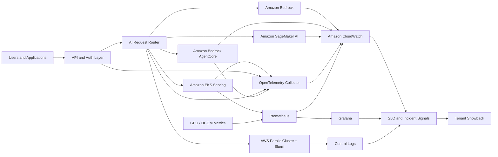

# Observability Model

## Purpose

This document defines the observability model for the enterprise AI control plane. It covers metrics, logs, traces, dashboards, service-level indicators, tenant-level showback, and incident-response signals across Amazon Bedrock, Amazon Bedrock AgentCore, Amazon EKS, Amazon SageMaker AI, AWS ParallelCluster + Slurm, and accelerator extension paths.

It is a reference model, not a deployed monitoring stack. Metric availability, log schemas, tracing support, service namespaces, and regional feature support must be validated for each workload and AWS Region.

## Observability Objectives

The observability model is intended to:

- detect user-visible degradation before it becomes a major incident;
- explain whether latency, errors, cost, or saturation originate in the model, runtime, queue, tool, retrieval path, network, or downstream service;
- compare workload placement decisions using measured behavior rather than assumptions;
- provide tenant-level usage, cost, and reliability evidence;
- preserve an auditable agent execution history across prompts, memory, retrieval, tool calls, approvals, and final outcomes;
- support capacity planning for tokens, requests, queues, pods, nodes, GPUs, and jobs; and
- give incident responders enough correlated evidence to triage without direct access to sensitive prompts or tenant data.

## Assumptions

- Workloads are placed using the [workload placement matrix](02-workload-placement-matrix.md).
- The organization uses Amazon CloudWatch as the AWS-native telemetry and alarm plane.
- OpenTelemetry is the preferred instrumentation standard for custom services and agent code.
- Amazon EKS workloads may use Prometheus and Grafana for platform and runtime metrics.
- GPU-level metrics are an extension path for workloads that operate GPU infrastructure directly.
- Cost data is used for showback and architecture decisions, not as a replacement for billing controls.
- Prompt, response, trace, and log data may contain sensitive information and must follow the [security model](04-security-model.md).

## Decision

Adopt a placement-aware observability model with a shared telemetry spine and runtime-specific instrumentation.

1. Use Amazon CloudWatch for AWS service metrics, logs, alarms, dashboards, and native service telemetry.
2. Use OpenTelemetry for custom application, inference, agent, and gateway traces, metrics, and logs.
3. Use Amazon Bedrock model invocation logging selectively, because invocation logs can include request and response content.
4. Use Amazon Bedrock AgentCore Observability for agent runtime traces, metrics, logs, and workflow inspection where AgentCore is selected.
5. Use Prometheus and Grafana for Amazon EKS platform metrics, custom model-serving metrics, queue metrics, and accelerator metrics.
6. Use NVIDIA DCGM exporter as the GPU metrics extension path for NVIDIA GPU workloads on platforms that expose GPU nodes.
7. Standardize service-level indicators across platforms: TTFT, latency, tokens/sec, queue wait time, error rate, cost per request, and tenant-level showback.
8. Correlate every request, agent run, memory operation, tool call, retrieval operation, model invocation, approval, and downstream API call with stable identifiers.
9. Separate operational telemetry from sensitive prompt and response payloads.
10. Treat observability gaps as architecture risks, not dashboard backlog.

## Telemetry Architecture

### Reading the Diagram

Read the diagram as a telemetry flow, not as the application request path:

1. User requests pass through the gateway and request router before reaching a workload platform.
2. AWS-managed services emit service metrics and logs primarily into Amazon CloudWatch.
3. Custom services and agents use OpenTelemetry so traces and metrics can cross service boundaries.
4. Amazon EKS workloads can emit runtime, queue, model-serving, and GPU metrics to Prometheus.
5. Grafana is used for operational dashboards where Prometheus is the primary metrics store.
6. Amazon CloudWatch, Prometheus, Grafana, and central logs feed SLO reporting and incident response.
7. Tenant showback is derived from correlated request, token, runtime, accelerator, and cost signals.

## Telemetry Types

| Telemetry type | Use it for | Examples |
|---|---|---|
| Metrics | Aggregated health, capacity, latency, throughput, and cost signals | TTFT p95, error rate, queue depth, GPU memory utilization, cost per request |
| Logs | Discrete events and structured records | request outcome, model invocation metadata, agent tool decision, scheduler job completion |
| Traces | Causal path across services and operations | gateway -> router -> retrieval -> model -> tool -> downstream API |
| Events | State changes requiring action or audit | deployment, scaling event, failed job, admission denial, model promotion |
| Profiles | Hot-path and resource analysis for custom code | CPU, memory, tokenizer, model loading, serialization overhead |

Metrics answer **what changed**. Logs answer **what happened**. Traces answer **where time went**. Events answer **what state changed**. Profiles answer **why this code path is expensive**.

## Core Service-Level Indicators

| SLI | Definition | Applies to | Primary use |
|---|---|---|---|
| Time to first token (TTFT) | Time from request acceptance to first streamed token | Streaming inference and agents | User-perceived responsiveness and model/runtime readiness |
| End-to-end latency | Time from request acceptance to final response or terminal failure | All online inference and agents | SLOs and incident detection |
| Tokens/sec | Output tokens generated per second after first token | Generative inference | Throughput and serving efficiency |
| Queue wait time | Time spent waiting before execution starts | EKS queues, Slurm jobs, batch inference, training | Capacity and scheduling health |
| Error rate | Failed requests or jobs divided by total attempts | All platforms | Reliability and regression detection |
| Cost per request | Allocated cost divided by successful business request | Online inference and agents | Unit economics and placement review |
| Cost per job | Allocated cost divided by completed job or training run | Batch, Slurm, HyperPod | Training and batch economics |
| Tenant showback | Usage and cost attributed to tenant, team, product, or environment | All platforms | Accountability, budgets, and chargeback readiness |

Do not use a single global SLO for every workload. A streaming support agent, batch embedding job, Slurm training run, and low-latency model endpoint need different SLOs and incident thresholds.

## Metrics Catalog

### Request and Model Metrics

| Metric | Description | Useful dimensions |
|---|---|---|
| `request_count` | Number of accepted requests | workload, tenant, model, endpoint, Region, placement path |
| `success_count` | Number of completed successful requests | workload, tenant, model, endpoint |
| `error_count` | Number of failed requests | workload, tenant, error class, dependency |
| `ttft_ms` | Time to first token | workload, tenant, model, runtime, streaming mode |
| `latency_ms` | End-to-end latency | workload, tenant, model, endpoint, operation |
| `input_tokens` | Prompt or input token count | workload, tenant, model |
| `output_tokens` | Generated output token count | workload, tenant, model |
| `tokens_per_second` | Output throughput after first token | workload, model, runtime, accelerator |
| `retry_count` | Application or SDK retries | workload, dependency, error class |
| `throttle_count` | Service, quota, or application throttles | workload, service, quota, tenant |

### Agent Metrics

| Metric | Description | Useful dimensions |
|---|---|---|
| `agent_session_count` | Number of agent sessions | agent, tenant, user class, environment |
| `agent_step_count` | Number of reasoning or tool steps per session | agent, tenant, outcome |
| `agent_run_duration_ms` | End-to-end duration of an agent run | agent, tenant, outcome |
| `tool_call_count` | Tool invocations attempted | agent, tool, tenant, decision |
| `tool_latency_ms` | Tool execution latency | tool, downstream service, tenant |
| `tool_error_count` | Tool failures by class | tool, error class, tenant |
| `approval_required_count` | Actions paused for human approval | agent, tool, risk class |
| `memory_read_count` | Memory reads attempted | agent, tenant, memory namespace, outcome |
| `memory_write_count` | Memory writes attempted | agent, tenant, memory namespace, outcome |
| `memory_latency_ms` | Latency for memory read or write operations | agent, tenant, memory namespace |
| `context_window_tokens` | Tokens assembled into the model context | agent, tenant, model |
| `context_truncation_count` | Context items omitted because of limits or policy | agent, reason, tenant |
| `loop_guard_trigger_count` | Runs stopped by recursion, budget, or time limits | agent, guardrail, tenant |

### Platform and Queue Metrics

| Metric | Description | Applies to |
|---|---|---|
| `queue_depth` | Work waiting to run | Amazon EKS queues, Slurm queues, batch workers |
| `queue_wait_ms` | Time before execution starts | Amazon EKS, Slurm, batch inference, training |
| `active_replicas` | Serving replicas currently active | Amazon EKS, custom inference |
| `pod_restart_count` | Container restart signals | Amazon EKS |
| `node_not_ready_count` | Unhealthy or unavailable nodes | Amazon EKS, Slurm clusters |
| `job_duration_seconds` | Runtime of training or batch jobs | Slurm, HyperPod, batch pipelines |
| `checkpoint_age_seconds` | Time since last successful checkpoint | Training and fine-tuning |

### Cost and Showback Metrics

| Metric | Description | Notes |
|---|---|---|
| `estimated_request_cost` | Estimated cost for an online request | Use current pricing inputs and measured token/runtime data; reconcile with billing data |
| `estimated_agent_session_cost` | Estimated cost for an agent run | Include model calls, tool calls, memory, retrieval, retries, and downstream APIs |
| `accelerator_seconds` | GPU, Trainium, or Inferentia allocation time | Requires platform-specific attribution |
| `idle_accelerator_seconds` | Allocated accelerator time without useful work | Useful for placement and capacity review |
| `tenant_cost` | Cost attributed to a tenant or product | Requires tagging, request metadata, or workload ownership mapping |

Cost metrics are estimates until reconciled with AWS Cost and Usage Reports, service billing data, or agreed allocation rules.

## CloudWatch Metrics, Logs, and Traces

Use Amazon CloudWatch as the default AWS-native observability plane.

- Collect AWS service metrics for Amazon Bedrock, Amazon EKS, Amazon SageMaker AI, AWS Lambda, Amazon API Gateway, Application Load Balancer, Amazon SQS, Amazon S3, and related dependencies.
- Send structured application logs to CloudWatch Logs where CloudWatch is the operational system of record.
- Use CloudWatch Logs Insights for operational queries over request, model, agent, and platform logs.
- Use CloudWatch alarms for SLO burn, error spikes, throttling, saturation, queue age, and missing telemetry.
- Use CloudWatch dashboards for executive and operations views when the data source is primarily AWS service telemetry.
- Use AWS X-Ray or CloudWatch trace views where OpenTelemetry traces are exported into AWS-managed tracing.

CloudWatch is not a substitute for instrumentation. Custom code must emit workload-level dimensions such as tenant, workload, model, endpoint, tool, and placement path.

## OpenTelemetry

Use OpenTelemetry for custom services and agent code because AI request paths often cross multiple runtimes and vendors.

### Required Trace Spans

A complete online AI trace should include spans for:

1. request ingress and authentication;
2. request routing and policy decision;
3. retrieval or vector-store lookup;
4. model invocation;
5. stream start and first token;
6. agent planning or step transition;
7. memory read, memory write, and context assembly;
8. tool selection and authorization;
9. approval workflow where required;
10. tool execution and downstream API calls;
11. response filtering and finalization; and
12. logging, audit, and metering emission.

### Required Attributes

Use stable, low-cardinality attributes where possible:

| Attribute | Purpose |
|---|---|
| `request.id` | Correlate logs, traces, metrics, and audit records |
| `tenant.id` | Showback and tenant incident scope |
| `workload.name` | Ownership and runbook routing |
| `environment` | Development, test, production, sandbox |
| `placement.path` | Amazon Bedrock, AgentCore, Amazon EKS, SageMaker, Slurm, external |
| `model.id` | Model or endpoint used |
| `agent.run_id` | Correlate all steps in one agent execution |
| `agent.step_id` | Order and inspect agent decisions inside a run |
| `tool.name` | Agent tool invoked |
| `tool.decision` | Allow, deny, error, or approval-required decision |
| `memory.operation` | Read, write, delete, summarize, or retrieve operation |
| `approval.status` | Approved, denied, pending, expired, or not required |
| `error.class` | Error grouping without leaking payload data |

Avoid high-cardinality or sensitive attributes such as raw prompts, full user identifiers, secrets, access tokens, unredacted documents, or complete response bodies.

## Amazon Bedrock Observability

For Amazon Bedrock workloads, collect both AWS service telemetry and application-side measurements.

- Use Amazon Bedrock model invocation logging when the organization explicitly accepts the data-retention and sensitivity implications.
- Model invocation logging can publish invocation logs, input data, output data, and metadata to Amazon CloudWatch Logs and Amazon S3 for supported runtime operations.
- Model invocation logging is disabled by default and should be enabled only with approved destinations, encryption, retention, and access controls.
- Application code should measure TTFT, end-to-end latency, token counts, retry behavior, throttling, and user-visible errors.
- Include request metadata or application-side dimensions for tenant and workload attribution where allowed by policy.
- Use Amazon CloudWatch metrics and alarms for invocation health, service throttling, and dependency failures.

Do not treat model invocation logs as ordinary debug logs. They may contain sensitive prompt and response content.

## Amazon Bedrock AgentCore Observability

For Amazon Bedrock AgentCore workloads, use AgentCore Observability for agent workflow inspection and operational telemetry.

AgentCore Observability provides trace, debug, and monitoring capabilities for agent performance. AWS documentation describes dashboards powered by Amazon CloudWatch, telemetry for metrics such as session count, latency, duration, token usage, and error rates, and OpenTelemetry-compatible telemetry output.

Instrument additional spans and metrics for application-specific behavior:

- tool authorization decisions;
- tool input validation failures;
- tool execution latency and outcome;
- approval workflow state;
- memory read/write behavior;
- loop, budget, and timeout guard triggers;
- downstream API dependencies; and
- final response outcome.

The key incident question for agents is not only whether the model responded. It is whether the agent followed the intended path, used approved tools, read and wrote the correct memory, stayed within policy and budget, and produced an auditable outcome.

## Agent Audit History

Agentic systems need an audit history that explains **what the agent did and why it was allowed to do it**. This is different from ordinary application logging. A single user-visible response may include multiple model calls, memory operations, retrieval steps, tool calls, approvals, retries, and downstream API calls.

Each agent run should produce a structured history with:

| History record | Purpose | Sensitive-data caution |
|---|---|---|
| Agent run record | Correlates user request, tenant, agent version, policy version, model, and final outcome | Do not store raw user input unless explicitly approved |
| Step record | Shows the ordered sequence of model, retrieval, memory, tool, and approval steps | Store summaries or references where full content is sensitive |
| Memory read record | Shows which memory namespace or item was used to assemble context | Avoid logging full memory content by default |
| Memory write record | Shows what memory was created, updated, summarized, or deleted | Store policy decision, pointer, hash, or redacted summary where possible |
| Context assembly record | Explains which retrieved or remembered items entered model context | Avoid storing full prompt payloads unless governed as sensitive data |
| Tool decision record | Captures allow, deny, approval-required, and policy reason | Do not log credentials or raw tool arguments containing secrets |
| Tool execution record | Captures target, latency, status, retry, and downstream correlation ID | Filter response bodies before adding them to traces |
| Approval record | Captures approver, decision, time, and reason for consequential actions | Protect approver and user identity according to access policy |
| Final outcome record | Captures response status, safety or policy outcome, cost estimate, and user-visible result class | Do not store full model output unless retention is approved |

Recommended identifiers:

- `agent.run_id` for the complete agent execution;
- `agent.step_id` for the ordered step within the run;
- `request.id` for cross-system correlation;
- `tenant.id` for tenant isolation and showback;
- `policy.version` for authorization and guardrail decisions;
- `memory.namespace` or `memory.reference` for memory traceability;
- `tool.name` and `tool.decision` for tool audit; and
- `approval.id` where human approval is required.

The audit history should make it possible to reconstruct the execution path without exposing unnecessary prompt, response, memory, document, credential, or tool payload content. Use references, hashes, redacted summaries, and retention controls where full content would create a privacy or security risk.

## Amazon EKS Observability

For Amazon EKS workloads, combine Kubernetes platform metrics, model-serving metrics, application traces, and accelerator metrics where applicable.

### EKS Metrics

Collect:

- node readiness, CPU, memory, filesystem, and network saturation;
- pod restarts, pending pods, failed scheduling, and eviction signals;
- deployment replica availability and rollout state;
- Kubernetes API errors and admission denials;
- queue depth and queue wait time for Kueue or equivalent schedulers;
- model server metrics from vLLM, Triton, or the selected serving runtime; and
- request latency, TTFT, tokens/sec, batch size, cache hit rate, and model-load time.

Use Amazon CloudWatch Container Insights where CloudWatch is the platform telemetry plane. Use Prometheus where the team needs Kubernetes-native scraping, model-serving metrics, GPU metrics, and flexible dashboarding.

### Prometheus and Grafana

Use Prometheus for scrape-based metrics that are not naturally emitted as CloudWatch metrics, especially Kubernetes, model-serving, queue, and GPU metrics. Use Grafana for operational dashboards that combine platform and application metrics.

Prometheus and Grafana should have clear ownership:

- retention and storage limits;
- scrape targets and label standards;
- dashboard review and retirement;
- alert routing and deduplication;
- tenant access to dashboards; and
- integration with incident response.

Avoid unbounded label cardinality. Labels such as raw request IDs, full user IDs, prompt hashes, or dynamic tool arguments can make Prometheus expensive and unreliable.

## DCGM and GPU Metrics Extension

For NVIDIA GPU workloads on Amazon EKS, Slurm, HyperPod, or external capacity, add GPU-level telemetry using NVIDIA DCGM or an equivalent provider-supported path.

Useful GPU metrics include:

| Metric area | Examples | Incident signal |
|---|---|---|
| Utilization | GPU utilization, streaming multiprocessor utilization | Underuse, saturation, placement mismatch |
| Memory | framebuffer memory used, memory errors | model size pressure, leaks, crash risk |
| Health | XID errors, ECC errors, retired pages | hardware or driver fault |
| Thermal and power | temperature, power draw, throttling | cooling, power, or density issue |
| Interconnect | NVLink or fabric throughput and errors | distributed training or multi-GPU bottleneck |
| Process accounting | process-level GPU use where supported | noisy neighbor or runaway job |

GPU metrics are an extension path, not a baseline requirement for Bedrock-only workloads. They become required when the platform team owns accelerator scheduling or capacity risk.

## Queue and Batch Observability

Queue wait time is a first-class SLI for batch inference, Slurm, training, and shared GPU platforms.

Track:

- queue depth by tenant, workload, priority, accelerator type, and Region;
- time from request or job submission to scheduling;
- time from scheduling to useful work start;
- job duration, failure class, retries, and checkpoint age;
- preemption, eviction, and capacity-unavailable events; and
- wasted accelerator time from failed or cancelled jobs.

For online inference, queue wait time often appears inside the serving runtime rather than a visible external queue. Expose it from the model server or admission layer where possible.

## Cost and Tenant-Level Showback

Tenant-level showback requires both telemetry and allocation rules. The observability layer should emit or derive:

- tenant ID or owning team;
- workload name and environment;
- placement path;
- request count and success count;
- input and output token counts;
- model or endpoint used;
- runtime duration;
- accelerator allocation time;
- tool and downstream API usage;
- storage and retrieval usage where material; and
- estimated unit cost.

Use showback to answer:

- Which tenants are driving token, GPU, queue, and retrieval cost?
- Which workloads have rising cost per successful request?
- Which requests are expensive because of retries, long outputs, tools, or retrieval?
- Which platforms have idle accelerator capacity?
- Which placement decisions should be revisited?

Cost per request should be calculated on successful business outcomes where possible, not only raw API attempts. Failed and retried requests still matter because they consume budget and may indicate reliability issues.

## Incident Response Signals

| Signal | Possible meaning | First response |
|---|---|---|
| TTFT p95 or p99 increase | model cold start, queueing, runtime saturation, provider issue | split by model, endpoint, tenant, and placement path |
| End-to-end latency increase | downstream tool, retrieval, model, network, or queue issue | inspect trace waterfall and dependency latency |
| Tokens/sec decrease | model runtime saturation, GPU pressure, serving regression | compare runtime, model, batch, and accelerator metrics |
| Queue wait increase | insufficient capacity, priority inversion, stuck scheduler | inspect queue depth, scheduling errors, node readiness |
| Error-rate spike | deployment regression, provider errors, dependency failure, policy denial | group by error class, version, dependency, and tenant |
| Throttling increase | quota limit, burst traffic, retry amplification | reduce retries, shed load, request quota review |
| Tool error increase | downstream API or authorization issue | inspect tool decision logs and API health |
| Memory read/write failure | memory service issue, authorization defect, tenant boundary problem | inspect memory operation traces, policy decisions, and tenant scope |
| Unexpected memory access | wrong tenant, stale context, policy bypass, or memory namespace error | isolate run, review memory audit history, validate tenant context |
| Approval backlog | missing approver, workflow outage, excessive consequential actions | inspect approval queue, risk class, and agent policy changes |
| Agent step count increase | tool loop, prompt regression, retrieval drift, harder task mix | inspect agent run history and loop guards |
| Retrieval latency increase | vector store, data API, network, or index issue | inspect retrieval spans and datastore metrics |
| Cost per request increase | prompt/output growth, retries, tool loops, model change | compare token, retry, tool, and model dimensions |
| Tenant cost spike | usage surge, runaway agent, misuse, batch launch | notify owner and apply budget or rate controls |
| GPU memory pressure | oversized model, fragmentation, leak, batch too large | inspect model server and DCGM metrics |
| Missing telemetry | collector, permissions, network, or deployment issue | treat as an incident for critical workloads |

Incident response should start from symptoms and dimensions, not from a single dashboard. Every alert should link to an owner, runbook, dashboard, and expected first query.

## Alerting and SLOs

Use alerts for user impact and leading indicators.

Recommended alert classes:

- SLO burn for latency, TTFT, error rate, and queue wait time;
- dependency failure or tool error spikes;
- throttling and quota exhaustion;
- missing telemetry from critical workloads;
- GPU health errors and node readiness issues;
- queue backlog and checkpoint age;
- cost anomaly or tenant budget breach; and
- audit or logging pipeline failure.

Avoid paging on raw CPU, memory, or GPU utilization alone unless it reliably predicts user impact. Use utilization signals as context or warning thresholds unless tied to a known failure mode.

## Dashboard Model

| Dashboard | Audience | Key views |
|---|---|---|
| Executive service health | Product and platform leaders | SLOs, incident status, cost per request, tenant showback |
| Operations overview | On-call engineers | latency, TTFT, error rate, queue wait, dependency health, active incidents |
| Bedrock usage | Platform and workload owners | model usage, tokens, latency, errors, logging status, tenant usage |
| Agent operations | Agent owners and responders | sessions, steps, tools, approvals, loops, tool errors, trace paths |
| Agent audit history | Security, agent owners, incident responders | run history, memory operations, tool decisions, approvals, policy versions, final outcomes |
| Amazon EKS inference | Platform engineers | pods, nodes, serving runtime, queues, model load, tokens/sec, errors |
| GPU capacity | AI infrastructure teams | GPU utilization, memory, health, errors, thermal, idle capacity |
| Cost and showback | Finance, platform, tenants | tenant usage, request cost, accelerator time, idle cost, trend by model |

Every dashboard should have an owner, data source, update expectation, and retirement criteria. A dashboard that no one trusts during an incident is not an operational control.

## Tradeoffs

| Decision | Benefit | Cost or limitation |
|---|---|---|
| CloudWatch-first telemetry | Native AWS service integration and alarms | Can require custom dimensions and exports for deep model-serving metrics |
| OpenTelemetry instrumentation | Portable traces across runtimes and vendors | Requires instrumentation standards and collector operations |
| Prometheus and Grafana for EKS | Strong Kubernetes and model-serving metrics support | Adds storage, scaling, label, and access-control ownership |
| Bedrock invocation logging | Detailed model invocation evidence | May capture sensitive content and is disabled by default |
| Tenant-level showback | Better accountability and placement decisions | Requires consistent tenant metadata and cost allocation rules |
| GPU metrics extension | Better accelerator capacity and incident diagnosis | Only useful where the platform owns GPU infrastructure |
| Detailed tracing | Faster root-cause analysis | Risk of sensitive data leakage if attributes are not controlled |

## Operational Considerations

- Define telemetry ownership before onboarding a workload.
- Treat missing telemetry as a launch blocker for production paths.
- Standardize low-cardinality metric labels and trace attributes.
- Redact or exclude prompts, responses, documents, secrets, tokens, and credentials from logs and traces.
- Correlate metrics, logs, traces, audit records, and cost records with a request ID and workload owner.
- Review dashboards and alerts after every incident.
- Reconcile estimated cost-per-request metrics against billing data on a regular cadence.
- Test observability during dependency failures, provider throttling, node loss, queue saturation, and runaway agent loops.
- Document which metrics are source-of-truth and which are derived estimates.

## Validation Checklist

- [ ] Workload placement path is documented.
- [ ] Owner, tenant, environment, and cost-allocation dimensions are defined.
- [ ] TTFT, latency, tokens/sec, queue wait time, and error rate are collected where applicable.
- [ ] Amazon Bedrock invocation logging decision is documented, including retention and sensitivity controls.
- [ ] Amazon Bedrock AgentCore observability is enabled or alternative agent tracing is implemented.
- [ ] Agent run history captures steps, memory operations, tool decisions, approvals, policy version, and final outcome where an agent runtime is used.
- [ ] OpenTelemetry spans cover request ingress, routing, retrieval, model invocation, tools, and downstream APIs.
- [ ] Amazon EKS metrics include node, pod, serving runtime, queue, and admission signals where applicable.
- [ ] Prometheus and Grafana ownership, retention, labels, and access controls are defined where used.
- [ ] DCGM or equivalent GPU metrics are enabled where accelerator capacity is customer-managed.
- [ ] Tenant-level showback can attribute requests, tokens, runtime, accelerator use, and estimated cost.
- [ ] Alerts route to owners and link to dashboards and runbooks.
- [ ] Sensitive content is excluded or explicitly governed in logs, traces, and invocation records.

## Official References

- [Monitor Amazon Bedrock using Amazon CloudWatch](https://docs.aws.amazon.com/bedrock/latest/userguide/monitoring-cloudwatch.html)
- [Amazon Bedrock model invocation logging](https://docs.aws.amazon.com/bedrock/latest/userguide/model-invocation-logging.html)
- [Amazon Bedrock AgentCore Observability](https://docs.aws.amazon.com/bedrock-agentcore/latest/devguide/observability.html)
- [Amazon CloudWatch Container Insights](https://docs.aws.amazon.com/AmazonCloudWatch/latest/monitoring/Container-Insights.html)
- [AWS Distro for OpenTelemetry](https://docs.aws.amazon.com/aws-otel/latest/userguide/what-is-adot.html)
- [Amazon Managed Service for Prometheus](https://docs.aws.amazon.com/prometheus/latest/userguide/what-is-Amazon-Managed-Service-Prometheus.html)
- [Amazon Managed Grafana](https://docs.aws.amazon.com/grafana/latest/userguide/what-is-Amazon-Managed-Service-Grafana.html)
- [NVIDIA DCGM exporter](https://docs.nvidia.com/datacenter/cloud-native/gpu-telemetry/latest/dcgm-exporter.html)
